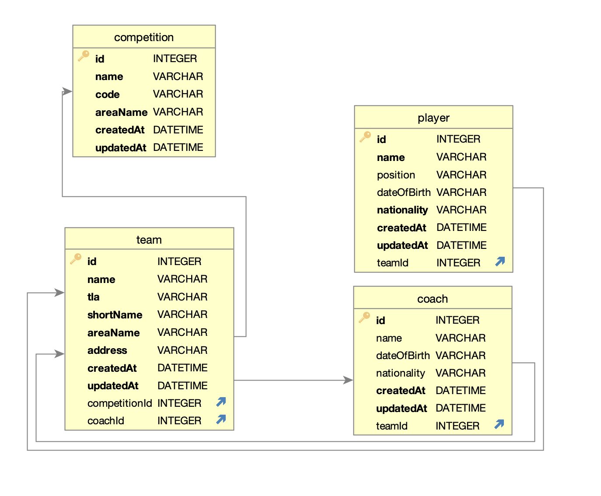

# Description

This is Hugo Virgen's answer to the following [Code Challenge.](./doc-assets/Santex_Backend_Test.pdf)

## Tech stack

- Node.js
- Nestjs.
- typeorm.
- sqlite

##  Data Schema

Given the specs described by challenge we will store the fulfilling this Schema.


## API endpoints

- POST /import-leagues
- GET /league/:leagueCode/players
- GET /league/:leagueCode/team
- GET /teams/:teamId/players

## Setup this project

1. Install project's dependencies and build application bundles by running `npm install` command.
2. create a `.env` file in project Root Directory (Using provided `.env.example` file in the same directory).
3. provide your valid football-data.org ApiKey as FOOTBALL_DATA_API_KEY Environment variable in `.env` file (otherwise project will never run).

## Optional: Build API Documentation

This project will build OpenAPI documentation during postinstall script.

```bash
npm run build:api-docs # <- run this script ONLY if api-docs/swagger.json file does not exist

# use Redoc CLI to parse file into HTML.
npx redoc-cli bundle -o api-docs/index.html api-docs/swagger.json

# launch docs using http-server.
npx http-server ./api-docs # <- Optionally launch docs using http-server.
```

After these steps, either open  `api-docs/index.html` with your browser or launch with `http-server` and navigate [localhost:8080](http://127.0.0.1:8080/) to read api-docs.

### Optional: Run tnd-to-end tests

```bash
npm run test:e2e
```

this command will generate coverage report files in `coverage/e2e` Path
